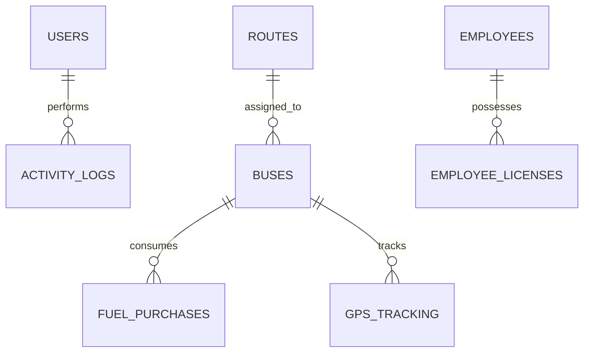

# DEPOT MANAGEMENT SYSTEM — BEGINNER'S COMPLETE TECHNICAL & LEARNING GUIDE

> **Welcome!** If you have **zero prior knowledge** of this project, this document is created specifically for you. It explains everything about the **Depot Management System for Bus Tracking** in plain, simple, beginner-friendly language with real-world analogies, step-by-step code flows, and database breakdowns.

---

## TABLE OF CONTENTS
1. [The Big Picture — What is this project?](#1-the-big-picture--what-is-this-project)
2. [The Tech Stack — Tools used and why](#2-the-tech-stack--tools-used-and-why)
3. [Architecture — How the code is organized (MVC Pattern)](#3-architecture--how-the-code-is-organized-mvc-pattern)
4. [Step-by-Step Flow — What happens under the hood when you click something?](#4-step-by-step-flow--what-happens-under-the-hood-when-you-click-something)
5. [Deep Dive into Every Feature & Screen](#5-deep-dive-into-every-feature--screen)
6. [The Database Explained — Tables and Connections](#6-the-database-explained--tables-and-connections)
7. [Design System & Styling (CSS)](#7-design-system--styling-css)
8. [Common Viva / Presentation Questions & Exact Answers](#8-common-viva--presentation-questions--exact-answers)
9. [How to Run and Test the Application](#9-how-to-run-and-test-the-application)

---

## 1. THE BIG PICTURE — WHAT IS THIS PROJECT?

### The Real-World Analogy
Imagine a busy Sri Lankan Ceylon Transport Board (**CTB / SLTB**) bus depot in **Kandy** or **Colombo**. Every day, dozens of buses leave the depot to take passengers across the country. 

Historically, the depot master managed everything using **heavy paper logbooks**:
* One book for bus registration and repair dates.
* One book for driver duty rosters and driving license renewals.
* One book for fuel station receipts (liters of diesel bought).
* Hand-drawn maps for route schedules and bus locations.

### The Solution: Depot Management System
This project is a **Windows Desktop Control Room Software** that replaces all those paper logbooks with a single digital application.

With this application, a Depot Manager or Clerk sitting at a desktop computer can:
1. **Track all buses:** See which buses are active, broken down, or due for servicing.
2. **Manage schedules & routes:** Set fares, route distances (e.g. Kandy to Colombo), and travel durations.
3. **Manage employees:** Store driver EPF numbers, conduct roster checks, and get red alerts if a driver's heavy vehicle license is expired.
4. **Log fuel expenses:** Record every liter of diesel pumped, track total spending in Sri Lankan Rupees (LKR), and spot fuel theft.
5. **Live GPS map tracking:** See bus locations on a live map (OpenStreetMap) right inside the application.
6. **Generate reports:** Click a button to download official PDF or Excel summaries for management.

---

## 2. THE TECH STACK — TOOLS USED AND WHY

Here are the main technologies used in this project and what each one does:

| Technology | What it is | Role in this project |
|---|---|---|
| **Java 21** | Programming Language | The primary coding language used to write all logic, data handling, and rules. |
| **JavaFX 13** | Desktop UI Framework | Draws the actual windows, buttons, text inputs, tables, charts, and maps on screen. |
| **Microsoft SQL Server (`DepotDB`)** | Relational Database | The permanent digital storage where all bus, route, fuel, and user records live. |
| **JDBC (`mssql-jdbc`)** | Database Connector | The bridge that allows Java code to send SQL queries to Microsoft SQL Server. |
| **Apache Maven (`pom.xml`)** | Build & Dependency Tool | Automatically downloads all required Java libraries and compiles the project. |
| **CSS (`modern-dashboard.css`)** | Styling Sheet | Gives the application its modern blue design, rounded cards, button colors, and hover effects. |
| **iText PDF & Apache POI** | Document Libraries | Generates downloadable PDF reports and Excel spreadsheets. |
| **OpenStreetMap & Leaflet JS** | Mapping Tools | Rendered inside JavaFX `WebView` to display interactive map pins for bus GPS coordinates. |

---

## 3. ARCHITECTURE — HOW THE CODE IS ORGANIZED (MVC PATTERN)

This project follows the industry-standard **MVC (Model-View-Controller)** pattern.

### Restaurant Analogy for MVC
Think of how a restaurant works:
* **View (The Menu & Table):** What the customer sees and interacts with.
* **Controller (The Waiter):** Takes the customer's order, brings it to the kitchen, and returns with food.
* **Service (The Chef):** Prepares the food and applies recipes/rules (business logic).
* **DAO / Database (The Pantry / Fridge):** Where ingredients (raw data) are stored and fetched.
* **Model (The Food Dish):** The formatted item containing data passed around.

### Code Organization (`src/main/java/lk/bustracking/depotmanagementsystem`)

```
lk.bustracking.depotmanagementsystem/
│
├── views/          # THE UI SCREENS (What you see)
│   ├── LoginView.java
│   ├── DashboardView.java
│   ├── BusManagementView.java
│   ├── RouteManagementView.java
│   ├── EmployeeManagementPanel.java
│   ├── FuelManagementPanel.java
│   └── GPSTrackingPanel.java
│
├── controllers/    # THE EVENT HANDLERS (Connects UI to logic)
│   ├── LoginController.java
│   ├── DashboardController.java
│   ├── BusController.java
│   ├── RouteController.java
│   └── FuelManagementController.java
│
├── services/       # THE BUSINESS LOGIC (Calculations & Rules)
│   ├── BusService.java
│   ├── RouteService.java
│   ├── EmployeeService.java
│   ├── FuelManagementService.java
│   ├── DashboardService.java
│   └── UserService.java
│
├── dao/            # DATA ACCESS OBJECTS (Talks directly to SQL Database)
│   ├── BusDAO.java
│   └── UserDAO.java
│
├── models/         # DATA ENTITIES (Plain Java Objects holding fields)
│   ├── Bus.java
│   ├── Route.java
│   ├── Employee.java
│   ├── EmployeeLicense.java
│   ├── FuelRecord.java
│   ├── User.java
│   └── ActivityLog.java
│
├── db/             # DATABASE CONNECTION
│   └── Database.java  # Opens connection to SQL Server (localhost:1433/DepotDB)
│
└── utils/          # HELPER UTILITIES
    ├── ValidationUtils.java   # Checks valid text, emails, numbers
    ├── AppLogger.java         # Logs errors and messages
    └── UIConstants.java       # Shared constants
```

---

## 4. STEP-BY-STEP FLOW — WHAT HAPPENS UNDER THE HOOD WHEN YOU CLICK SOMETHING?

Let's trace **two real scenarios** step-by-step through the code so you understand how data moves.

### Scenario A: Logging into the System
1. **User Action:** The user types `admin` and `admin123` into `LoginView.java` and clicks the **"Sign In"** button.
2. **View to Controller:** The button click fires an event that calls `LoginController.handleLogin()`.
3. **Validation Check:** `LoginController` calls `ValidationUtils.isNotEmpty()` to make sure username and password aren't blank.
4. **Background Task (Async):** To stop the computer screen from freezing while talking to SQL Server, `LoginController` starts a JavaFX `Task<User>` background thread.
5. **Controller to Service to DAO:** The background thread calls `UserService`, which calls `UserDAO.validateLogin(username, password)`.
6. **SQL Query Execution:** `UserDAO` hashes the typed password using **SHA-256** and runs this SQL query:
   ```sql
   SELECT * FROM Users WHERE username = ? AND password = ?
   ```
7. **Database Connection:** `UserDAO` gets a fresh connection from `Database.getConnection()`, executes the query securely using `PreparedStatement` (preventing SQL Injection), and gets a matching row.
8. **Result Returning Up:** 
   * `UserDAO` creates a `User` object filled with database data.
   * Passes it back to `UserService` -> `LoginController`.
9. **UI Update:** `LoginController` receives success and tells JavaFX: *"Close LoginView, open DashboardView!"*

---

### Scenario B: Adding a New Bus to the Fleet
1. **User Action:** User clicks **"+ Add Bus"** button in `BusManagementView.java`.
2. **Dialog Form:** A popup dialog (`GridPane` form) opens asking for: Bus Number (e.g. `NB-4521`), Registration (e.g. `WP-NA-4521`), Capacity (`54`), and Model (`TATA LP 1512`).
3. **User Clicks Save:** The dialog calls `BusController.handleCreateBus(busToSave)`.
4. **Controller to Service:** `BusController` passes the `Bus` model object to `BusService`.
5. **Business Rule Verification:** `BusService` checks if `capacity > 0` and if the registration number is unique.
6. **Service to DAO:** `BusService` calls `BusDAO.saveBus(bus)`.
7. **SQL INSERT Execution:** `BusDAO` runs:
   ```sql
   INSERT INTO Buses (bus_number, registration_number, capacity, model, status, condition_status, current_mileage)
   VALUES (?, ?, ?, ?, ?, ?, ?)
   ```
8. **UI Auto-Refresh:** Once inserted into SQL Server, `BusController` tells `BusManagementView` to re-fetch all buses (`BusDAO.getAllBuses()`). The table automatically redraws with the new bus!

---

## 5. DEEP DIVE INTO EVERY FEATURE & SCREEN

### Screen 1: Login & Security (`LoginView.java`, `UserDAO.java`)
* **Security Guard:** Only authorized personnel can log in.
* **Roles:** Two user levels exist:
  * `ADMIN`: Full access to everything including system settings and staff permissions.
  * `STAFF`: Access to day-to-day operations (bus view, fuel logging).
* **Account Lockout Feature:** If anyone enters an incorrect password **8 times in a row**, `LoginController` temporarily locks the account for **5 minutes** to prevent brute-force hacking.

---

### Screen 2: Main Dashboard (`DashboardView.java`, `DashboardService.java`)
* **The Control Tower:** Gives an instant summary of the entire depot at a glance.
* **KPI Summary Cards:**
  1. **Total Buses:** Count of all buses in the fleet.
  2. **Active Routes:** Number of operating schedules.
  3. **Staff Members:** Drivers, conductors, mechanics.
  4. **Total Fuel Cost:** Expenditure recorded in LKR.
* **Connection Status Badge:** Shows a green badge `"Database Connected"` by running `Database.testConnection()`.

---

### Screen 3: Bus Management (`BusManagementView.java`, `BusDAO.java`)
* **Fleet Table:** Displays all buses with columns: Bus Number, Registration Number, Capacity, Model, Status, Condition, Mileage, and Service Due Date.
* **Color Badges:**
  * Green Badge: `ACTIVE`
  * Amber Badge: `MAINTENANCE`
  * Red Badge: `INACTIVE`
* **"Needs Attention" Alert:** The application automatically scans all buses. If a bus has mileage over its service limit, is marked as `POOR` condition, or is overdue for servicing, it gets flagged under *"Needs Attention"*.

---

### Screen 4: Route Management (`RouteManagementView.java`, `RouteService.java`)
* **Schedule Table:** Manages 9 detailed route parameters:
  1. Route Number (e.g. `Route 602`)
  2. Route Name (e.g. `Kandy - Colombo Express`)
  3. Start Terminal (`Kandy Central Bus Stand`)
  4. End Terminal (`Colombo Fort Terminal`)
  5. Distance (`115.5 km`)
  6. Duration (`180 minutes`)
  7. Service Type (`EXPRESS` / `INTERCITY` / `NORMAL`)
  8. Ticket Fare (`LKR 550.00`)
  9. Operating Hours (`05:00 - 22:00`)

---

### Screen 5: Employee & License Management (`EmployeeManagementPanel.java`)
* **Staff Registry:** Stores Employee Name, EPF Number, NIC Number, Designation (`DRIVER`, `CONDUCTOR`, `MECHANIC`), and Phone Number.
* **License Verification Dialog:** Heavy vehicle driving licenses expire legally. This dialog allows selecting a driver and checking their license number, type, issue date, and expiry date. If the expiry date is in the past, it shows a **Red "EXPIRED" Warning** so the depot master does not assign an unlicensed driver to a bus!

---

### Screen 6: Fuel Management (`FuelManagementPanel.java`)
* **Transaction Table:** Logs every refueling event: Refueling Date, Target Bus Number, Fuel Type (`DIESEL` / `SUPER_DIESEL`), Volume in Liters, Total Cost in LKR, Driver Name, and Fuel Station Name.
* **Analytics Charts:**
  * BarChart showing daily fuel consumption trends.
  * LineChart showing fuel efficiency (km per liter) across different buses.

---

### Screen 7: GPS Live Map Tracking (`GPSTrackingPanel.java`)
* **How it works:** JavaFX has a built-in browser engine called `WebView`.
* **Map Rendering:** The view loads an HTML page with OpenStreetMap and Leaflet JavaScript libraries.
* **Live Marker:** It queries the `GPS_Tracking` table in SQL Server for the latest latitude and longitude of a selected bus (e.g. Latitude `7.2906`, Longitude `80.6337` for Kandy) and places a live pin on the interactive map!

---

## 6. THE DATABASE EXPLAINED — TABLES AND CONNECTIONS

All data is stored inside Microsoft SQL Server in a database called **`DepotDB`**.

### Overview of Database Tables



1. **`Users` Table:** Stores login accounts (user_id, username, hashed password, full_name, role, status).
2. **`Buses` Table:** Stores vehicle fleet details (bus_id, bus_number, registration_number, capacity, model, status, condition_status, current_mileage, next_service_due, assigned_route_id).
3. **`Routes` Table:** Stores bus schedules (route_id, route_number, route_name, start_location, end_location, distance_km, estimated_duration_minutes, fare, status).
4. **`Employees` Table:** Stores depot staff details (employee_id, epf_number, full_name, nic_number, designation, contact_number).
5. **`Employee_Licenses` Table:** Stores driving licenses (license_id, employee_id, license_number, expiry_date, status).
6. **`FuelPurchases` Table:** Stores diesel transactions (record_id, bus_id, date, quantity_liters, total_cost, station_name).
7. **`GPS_Tracking` Table:** Stores location pings (tracking_id, bus_id, latitude, longitude, speed, timestamp).

---

## 7. DESIGN SYSTEM & STYLING (CSS)

Unlike basic Java projects that use ugly default grey windows, this project uses a centralized CSS design file located at:
`src/main/resources/styles/modern-dashboard.css`

### Reusable CSS Classes Used in Java Code
* `.btn-primary` — Deep royal blue button (used for primary actions like Save or Search).
* `.btn-success` — Vibrant green button (used for Add / Create actions).
* `.btn-warning` — Amber orange button (used for Edit actions).
* `.btn-danger` — Red button (used for Delete / Lock actions).
* `.stat-card` — White card container with subtle shadow used for summary metrics.
* `.table-view` — Styled table headers with padding and clean cell borders.

---

## 8. COMMON VIVA / PRESENTATION QUESTIONS & EXACT ANSWERS

If an examiner or lecturer asks you questions about this project, here are the exact answers to give:

### Q1: What architecture does this project use and why?
**Answer:** *"The project uses the **Model-View-Controller (MVC)** design pattern. Views handle JavaFX screens, Controllers manage events, Services execute business rules, and DAOs handle SQL queries. This separation ensures code maintainability, clean structure, and security."*

### Q2: How do you prevent SQL Injection vulnerabilities?
**Answer:** *"All database queries in DAO classes use **`PreparedStatement`** with parameter placeholders (`?`). We never concatenate raw input strings into SQL queries."*

### Q3: Why JavaFX instead of a Web Application?
**Answer:** *"A native JavaFX desktop application was chosen as a diploma requirement to demonstrate desktop GUI development, multi-threading, and local database interaction. Desktop apps provide fast offline operation for depot workstations without requiring web servers."*

### Q4: How is password security handled?
**Answer:** *"Passwords are hashed using **SHA-256** in `UserDAO` before checking or saving to SQL Server. Additionally, an 8-failed-attempt lockout safeguard prevents brute-force attacks."*

### Q5: How does the application prevent UI freezing during long database queries?
**Answer:** *"We use JavaFX **asynchronous `Task` threads**. Database operations run on background threads, and `Platform.runLater()` updates the UI safely once results return."*

---

## 9. HOW TO RUN AND TEST THE APPLICATION

### Prerequisites
1. **Java JDK 21** installed.
2. **Microsoft SQL Server** running locally on port `1433` with database name `DepotDB`.

### Running from Terminal / Command Line
Open PowerShell or Command Prompt in the project folder and run:

```powershell
# Method 1: Using the provided quick run script
.\run.cmd

# Method 2: Using Maven directly
.\mvnw.cmd clean compile
.\mvnw.cmd javafx:run
```

---

## SUMMARY CHECKLIST FOR YOU

1. **Project Name:** Depot Management System for Bus Tracking
2. **Main Language:** Java 21 with JavaFX 13 GUI
3. **Database:** Microsoft SQL Server (`DepotDB`)
4. **Key Pattern:** MVC (Model-View-Controller)
5. **Main Features:** Fleet Management, Route Schedules, Staff & License Expiry Tracking, Fuel Expense Logs, Live GPS OpenStreetMap Tracking, PDF/Excel Reports.

*You are now fully equipped to understand, explain, present, and work with this project!*
